# MongoDB queries

### Trova tutte le risorse con il dato isActive corrispondente a true (51 risultati)

```
{ isActive: true }
```

### Trova tutte le risorse con il dato age maggiore di 26 (54 risultati)

```
{ age: { $gt: 26 } }
```

### Trova tutte le risorse con il dato age maggiore di 26 e minore o uguale a 30 (19 risultati)

```
{ age: { $gt: 26, $lte: 30 } }
```

oppure (ma la sintassi è più lunga quindi non da preferire):

```
{ $and: [ { age: { $gt: 26 } }, { age: { $lte: 30 } } ] }
```

### Trova tutte le risorse con il dato eyes che sia brown o blue (66 risultati)

```
{ eyeColor: { $in: ['brown', 'blue'] } }
```

oppure (ma la sintassi è più lunga quindi non da preferire):

```
{ $or: [ { eyeColor: { $eq: 'brown' } }, { eyeColor: { $eq: 'blue' } } ] }
```

questa sintassi è utile se le condizioni vanno applicate su campi diversi ad esempio:

### Trova tutte le risorse con il dato eyes uguale a brown oppure con età maggiore di 30 (54 risultati)

```
Query: { $or: [ { eyeColor: { $eq: 'brown' } }, { age: { $gt: 30 } } ] }
Project: { _id: 0, age: 1, eyeColor: 1 }
Sort: { age: 1 }
```

### Trova tutte le risorse che non presentano il dato eyes uguale a green (66 risultati)

```
{ eyeColor: { $ne: 'green' } }
```

### Trova tutte le risorse con non presentano il dato eyes uguale a green e neanche blue (35 risultati)

```
{ eyeColor: { $nin: ['green', 'blue'] } }
```

oppure (ma la sintassi è più lunga quindi non da preferire):

```
{ $and: [ { eyeColor: { $ne: 'green' } }, { eyeColor: { $ne: 'blue' } } ] }
```

### Trova tutte le risorse con il dato company uguale a "FITCORE" e ritorna solo l'email (1 risultato)

```
Query: { company: 'FITCORE' }
Project: { _id: 0, email: 1 }
```

oppure con le regular expressions per fare la ricerca ignorando il case dei caratteri:

```
{ company: /^fitcore$/i }
```

## Regular Expressions (RegEx)

### Cercare "sunt velit" nel campo about degli utenti (case insensitive) (2 risultati)

```
{ about: /sunt velit/i }
```

### Trovare tutte le email che finiscono per ".com" (case insensitive) (8 risultati)

```
{ email: /\.com$/i }
```

### Trovare tutti gli utenti il cui nome incomincia per "e" o "E" (case insensitive) (3 risultati)

```
Query: { "name.first": /^e/i }
Project: { _id: 0, firstname: "$name.first" }
```

### Trovare tutti gli utenti il cui cognome è composto da 4 caratteri (13 risultati)

```
Query: { "name.last": /^.{4}$/i }
Project: { _id: 0, lastname: "$name.last" }
```

### Trovare tutte le email che incominciano per "d" o "D" e finiscono con ".com" (case insensitive) (2 risultati)

```
{ email: /^e.*\.com$/i }
```

## Aggregations

### Eta' massima degli utenti (40 anni)

```
[
    {
        $group: {
            // _id null significa che non dobbiamo raggruppare secondo nessun campo
            // ma ci serve un gruppo con tutti i documenti
            _id: null,
            // qui chiediamo di trovare il massimo valore presente nella colonna "age"
            // del gruppo creato (che in questo caso contiene tutti i documenti)
            maxAge: { $max: '$age' },
        },
    },
]
```

### Numero di utenti per ciascuna età ordinando i risultati per età in ordine crescente (21 risultati)

```
[
    {
        $group: {
            // chiediamo di raggruppare gli utenti in base all'età
            _id: '$age',
            // chiediamo di contare gli elementi di ciascun gruppo
            count: {
                $count: {},
            },
        },
    },
    {
        // diciamo quali campi ci interessa vedere
        // qui stiamo nascondendo il campo "_id" e
        // lo stiamo rinominando "age" perhè è più chiaro
        $project: {
            _id: 0,
            age: '$_id',
            count: 1,
        },
    },
    {
        // chiediamo di ordinare i risultati per età in ordine crescente
        $sort: {
            age: 1,
        },
    },
]
```

## Infrastruttura


